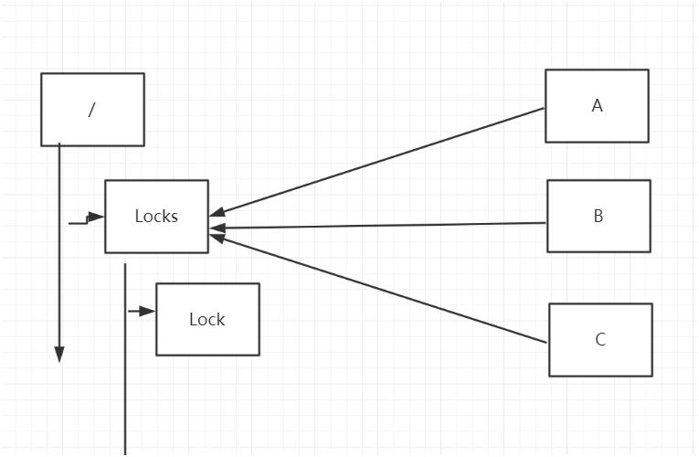

### zookeeper能做什么

#### 数据的发布/订阅

> 统一配置管理（disconf）
>
> 实现配置信息的集中式管理和数据的动态更新
>
>  
>
> 实现配置中心有两种模式：push、pull。
>
> 长轮训
>
> zookeeper采用的是推拉相结合的方式。 客户端向服务器端注册自己需要关注的节点。一旦节点数据发生变化，那么服务器端就会向客户端
>
> 发送watcher事件通知。客户端收到通知后，主动到服务器端获取更新后的数据

1. 数据量比较小

2. 数据内容在运行时会发生动态变更

3. 集群中的各个机器共享配置

#### 负载均衡

> dubbo利用了zookeeper机制实现负载均衡

#### 命名服务

#### master选举

> kafka

#### 分布式队列

#### 分布式锁

redis

数据库

##### zookeeper

###### 排他锁

###### 共享锁

#### ID生成器